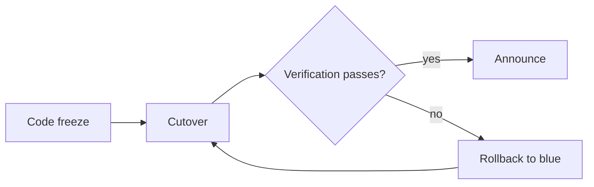
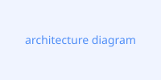

# Launch Runbook

This is the day-of-launch runbook for [[Alpha Launch]], part of the broader
[[Acme Initiative]]. It exists mainly as a long-form test article: it deliberately
exercises most of the rendering pipeline (headings, callouts, quotes, highlights,
tables, code, task lists, and a Mermaid diagram) in one page, so it's useful both for
eyeballing the note-page layout and for checking print/PDF output across several pages
worth of content.

For background on why this project exists in the first place, see [[Beta Notes]] -
though that note is marked private, so its title should never actually surface on the
published site.

## Overview

> [!abstract] TL;DR
> Launch day runs in four phases - freeze, cutover, verification, and announce - with a
> rollback checkpoint after each one. Anyone paging on-call should start at
> [Rollback procedure](#rollback-procedure) below.

The plan below assumes a standard blue/green cutover. Each phase has an owner, an
expected duration, and a set of exit criteria that must be true before moving on.

### Phase 1: Code freeze

> [!note]
> Code freeze begins at 09:00 and covers every service in the `alpha` deployment group.
> Hotfixes still require sign-off from the on-call lead.

- [x] Merge freeze announced in `#launch-alpha`
- [x] Feature flags for the new checkout flow locked to their launch-day values
- [ ] Final smoke test run against staging
- [ ] Release notes drafted and reviewed

### Phase 2: Cutover

> [!tip]+ Cutover checklist (click to expand)
> 1. Drain traffic from the blue environment over 10 minutes.
> 2. Confirm green environment error rate stays under 0.1%.
> 3. Flip the load balancer's default target group.
> 4. Watch dashboards for 15 minutes before declaring cutover complete.

This is the step most likely to page someone, so it gets its own warning:

> [!warning] Traffic drain timing
> Draining too quickly (under ~5 minutes) has previously caused a thundering-herd
> reconnect spike on the checkout service. Do not shorten the drain window without
> sign-off from Infra.

### Phase 3: Verification

A quick reference for what "healthy" looks like after cutover:

| Signal | Healthy range | Who owns it |
| --- | --- | --- |
| p99 latency (checkout) | < 400ms | Infra |
| Error rate | < 0.1% | Infra |
| Payment success rate | > 99.5% | Payments |
| Queue depth (order events) | < 500 | Platform |

If any signal is out of range for more than five minutes, treat it as a **==launch
blocker==** and move straight to the rollback procedure.

```js
// Rough shape of the health-check script run every 30s during verification.
async function checkSignals(signals) {
  const results = await Promise.all(signals.map(fetchSignal));
  const failing = results.filter((r) => !r.healthy);
  if (failing.length > 0) {
    console.warn("Launch blocker detected:", failing.map((r) => r.name));
  }
  return failing.length === 0;
}
```

> [!question] What counts as "sustained"?
> Five consecutive failing checks (2.5 minutes at the current polling interval), not
> five minutes of wall-clock time - a couple of isolated blips shouldn't trigger a
> rollback on their own.

### Phase 4: Announce

> [!success]
> Once verification passes, post the announcement, close out the launch tracking
> issue, and unfreeze the merge queue.

## Rollback procedure

> [!danger] Rollback
> Flipping the load balancer back to blue is safe at any point before the announce
> step. After announcing, treat a rollback as an incident, not a routine step - loop in
> the incident commander first.



## Retro notes from the last launch

> Everything about the mechanics of cutover went fine. What actually slowed us down was
> that nobody had a clear owner for the payments dashboard, so "is it healthy" took ten
> minutes to answer instead of thirty seconds.
>
> — paraphrased from the [[Alpha Launch]] post-mortem

A few follow-ups came out of that:

1. Assign an explicit owner to every row in the verification table above, not just a team.
2. Rehearse the rollback path in staging the week before launch, not just read about it.
3. Keep this runbook itself under version control next to the code it launches, per
   [[Acme Initiative]] conventions - which is, recursively, part of why this note is
   itself a Tolaria note rather than a wiki page somewhere else.

> [!bug] Known issue
> The health-check script above doesn't currently distinguish a `503` from a `429`,
> which means a rate-limited dependency can look identical to a genuinely unhealthy one
> in the dashboard. Fixing this is tracked separately and out of scope for this runbook.

## Appendix: architecture reference

See the attached diagram for how the launch-day traffic path maps onto the services
mentioned above.


