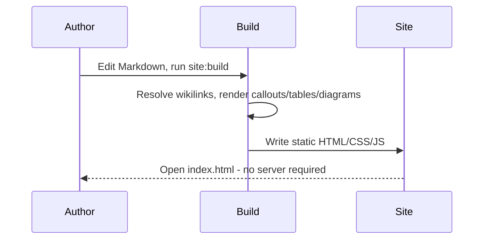

# Style Guide

A single page exercising every visual element the renderer currently supports, kept
up to date as new features land. Useful for eyeballing note-page layout, theme
switching, and print/PDF output all in one place, without hunting through several
"real" notes. It borrows `type: Project` for its frontmatter since that's the only
type this sample vault defines — the badge above is otherwise just decoration here.

## Headings

The page title itself renders as a level-1 heading, and this section header is a
level 2 - everything below steps down from there.

### Heading level 3

#### Heading level 4

##### Heading level 5

###### Heading level 6

## Text formatting

**Bold**, *italic*, ***bold italic***, ~~strikethrough~~, and `inline code` all read
clearly at body size. Obsidian-style ==highlighted text== gets its own background
color rather than just changing the text color, so it stays legible in both themes.

Links come in two flavors: an ordinary [external link](https://example.com), and a
wikilink to another note in this vault, like [[Acme Initiative]]. A wikilink whose
target doesn't exist - [[This Note Does Not Exist]] - degrades gracefully to plain
styled text instead of breaking the page, which is deliberate: an author renaming or
deleting a note shouldn't be able to take down pages that still reference it.

## Blockquote

> Everything about the mechanics worked fine. What actually slowed things down was
> that nobody had a clear owner for one of the dashboards, so "is it healthy" took
> ten minutes to answer instead of thirty seconds.
>
> — a plain blockquote, as opposed to the callouts below

## Callouts

Every callout type currently defined, each with its own color and icon:

> [!note]
> A general-purpose note.

> [!abstract] Custom title on an abstract callout
> Abstracts default to a "TL;DR"-shaped summary at the top of a longer document.

> [!info]
> Informational, lower-urgency than a warning.

> [!todo]
> An outstanding action item.

> [!tip]+ Foldable, open by default
> A `+` after the type keeps this callout expanded but still collapsible - click the
> title to fold it.

> [!success]
> Something completed without issue.

> [!question]
> An open question that hasn't been resolved yet.

> [!warning]
> Something that needs attention before it becomes a problem.

> [!failure]
> A check or expectation that didn't pass.

> [!danger]
> Higher severity than a warning - the home page's announcement banner reuses this
> exact color and icon.

> [!bug]
> A known defect, tracked separately from the surrounding content.

> [!example]
> A worked example, kept visually distinct from the main explanation.

> [!quote]-
> A `-` after the type starts this callout folded - click the title to expand it.
> Distinct from the plain blockquote above: this one is titled, colored, and
> collapsible.

## Lists

Unordered, with nesting:

- First-level item
  - Nested item
  - Another nested item
- Second first-level item

Ordered:

1. Freeze
2. Cutover
3. Verification
4. Announce

Tasks, mixed state:

- [x] Draft this page
- [x] Cover every callout type
- [ ] Add a diagram type not already used elsewhere in the vault

## Tables

| Element | Comes from | Notes |
| --- | --- | --- |
| Type badge | `type:` frontmatter | Falls back to `_sidebar_label` if set |
| Local graph | `belongs_to`/`has`/`related_to` + backlinks | Rendered per-note, build time |
| Table of contents | Headings in the body | Only appears with 2+ headings |

## Code

Inline `const x = 1;` alongside a fenced block, syntax-highlighted:

```ts
interface Signal {
  name: string;
  healthy: boolean;
}

function summarize(signals: Signal[]): string {
  const failing = signals.filter((s) => !s.healthy).map((s) => s.name);
  return failing.length ? `Unhealthy: ${failing.join(", ")}` : "All signals healthy";
}
```

## Diagram



## Image


## Divider

Content above a horizontal rule.

---

Content below one.

## Relationships & graph

This page declares `related_to: [[Acme Initiative]]` in its frontmatter purely to
give the local graph below something to draw, and to exercise the relationship
section above it. The site-wide graph (linked from the header) includes this page
too, sized like every other node by how many incoming connections it has.
